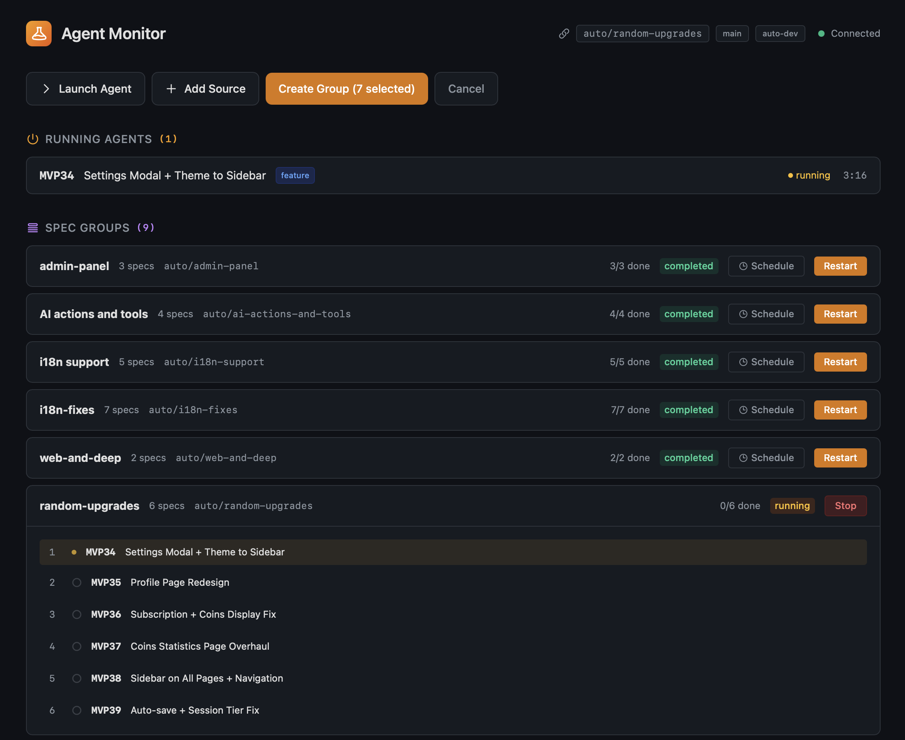
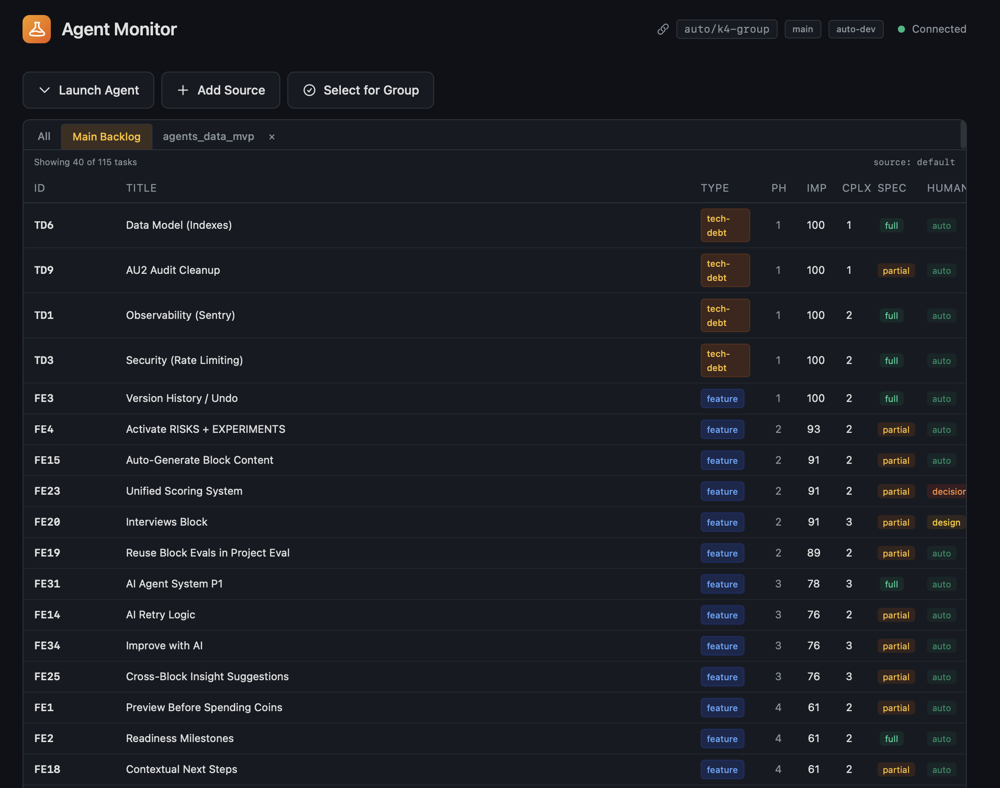
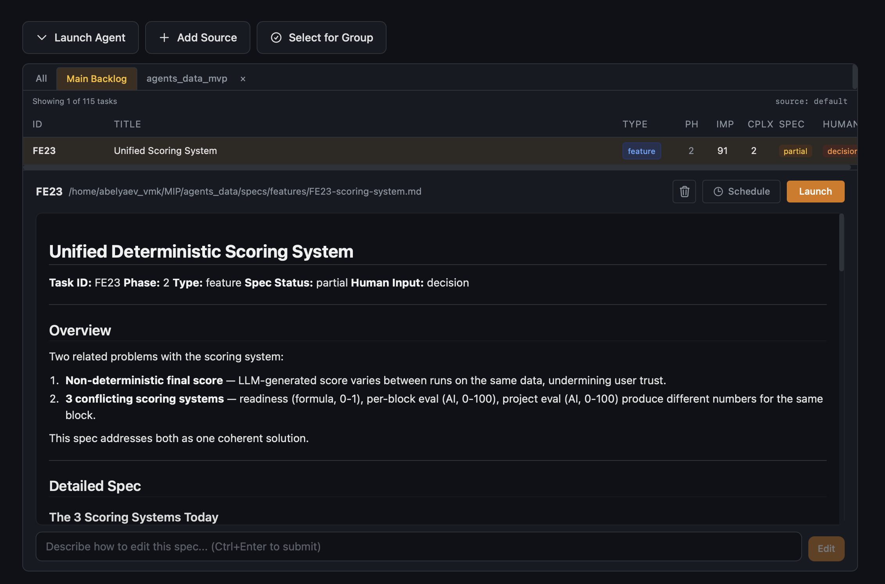
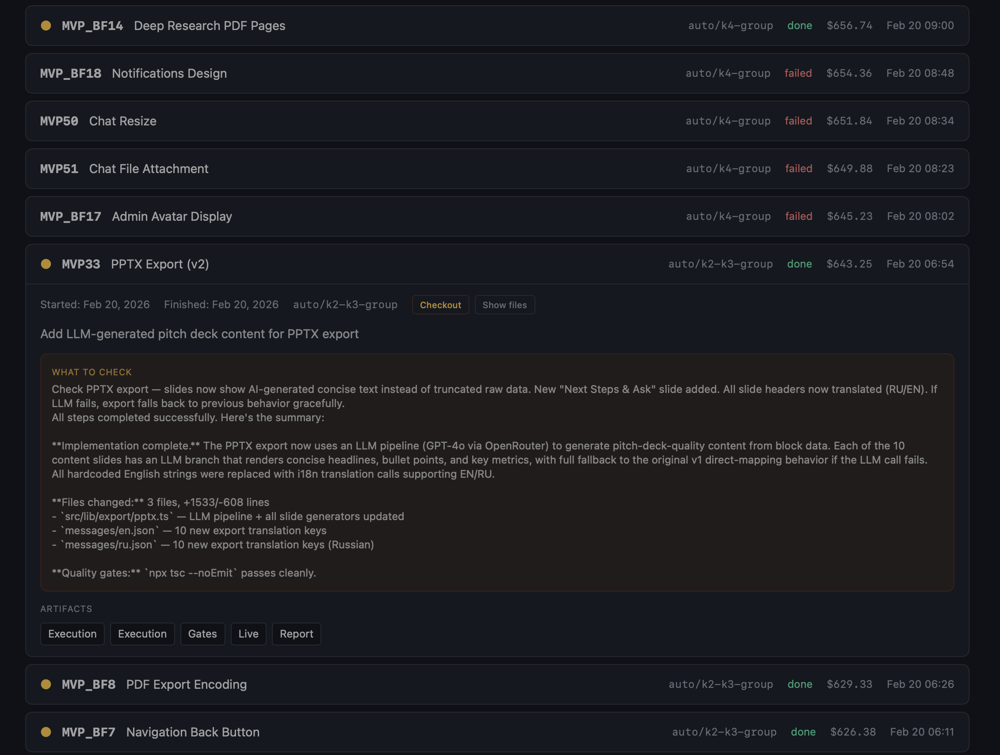

# Multi-Agent Orchestrator

Autonomous task execution system powered by Claude. Reads a backlog,
picks tasks by priority, writes code through coordinated AI agents,
runs quality gates, and commits to feature branches for human review.



## Quick Start

See [Getting Started](getting-started.md) for the full walkthrough.

```bash
# 1. Install
cd multiagent && python -m venv .venv && source .venv/bin/activate
pip install -r requirements.txt

# 2. Initialize for your project
cd /your-project && multiagent/.venv/bin/python -m multiagent init

# 3. Describe tasks — via Claude Code, CLI, or manually
python -m multiagent spec "Add user authentication with JWT"

# 4. Launch the dashboard
python -m multiagent.server
# Open http://localhost:8000
```

After init, you describe tasks, review generated specs, and manage everything through the **web dashboard** — launch agents, group related tasks, watch real-time logs, review results.

## Creating Tasks

The recommended workflow is to describe what you want and let the system generate structured specs.

### Claude Code (Recommended)

Open your project directory in Claude Code and describe the task naturally:

> "I need a dark mode toggle in the settings page that persists the preference"

Claude will create a spec file, assign a task ID, and add the backlog entry. You review and refine.

This is the fastest way to create specs because Claude has full project context — it reads your codebase, conventions, and existing patterns.

### CLI

```bash
python -m multiagent spec "Add dark mode to settings page"
python -m multiagent spec --file feature-draft.md
python -m multiagent spec --file big-plan.md -y    # auto-create multiple specs
python -m multiagent spec "Fix crash on empty email login" --phase 2
```

The CLI uses AI to generate a structured spec from a description string or a text file. When a file contains multiple tasks, the CLI detects this and asks whether to create separate specs (`-y` to auto-confirm).

### Full Workflow

```
init → describe tasks → review specs → dashboard → review branches
  │          │               │             │              │
  ▼          ▼               ▼             ▼              ▼
 Setup    Claude Code    Edit specs    Run agents    Merge to main
         or CLI spec    if needed     via dashboard
```

For the complete spec writing guide, see **[Writing Specs](writing-specs.md)**.

## How It Works

```
Backlog → Pick task → Create branch → Enrich spec → Build plan → Implement → QG → Review → Commit
           │                            │                          │           │
           ▼                            ▼                          ▼           ▼
     task_loader.py              Product Agent              Implementor   Reviewer
                                 Analyst Agent              (per step)    Visual Tester
```

1. **Task selection** — highest priority actionable task from the backlog
2. **Branch creation** — `auto/{task_id}` from `auto-dev`
3. **Spec enrichment** — Product + Analyst agents fill in UX, edge cases, technical plan
4. **Implementation** — Implementor writes code step by step, quality gates after each step
5. **Review** — Reviewer checks the full diff, Visual Tester captures screenshots
6. **Commit** — changes committed on the feature branch for human review

## Web Dashboard

The dashboard is the primary way to interact with the system. Start it with `python -m multiagent.server` and open `http://localhost:8000`.

### Task List & Spec Editor



Browse your full backlog with sorting by importance, complexity, type. Click any task to view and edit its spec. The built-in AI editor lets you modify specs with natural language instructions — just describe what to change.

**Task types:** `feature` (green) — full pipeline with Product + Analyst agents. `tech-debt` (orange), `refactor`, `bugfix` — skip Product, go straight to Analyst. `audit` (purple) — read-only analysis, no code changes.

### Spec Groups

Select multiple related tasks, bundle them into a **group**, and run them sequentially on a shared branch. Each task in the group sees changes from the previous ones. Groups can be started, stopped, retried, or scheduled.



### Execution & Archive



Watch agents work in real-time with streaming logs. When tasks complete, the archive shows full details: what changed, quality gate results, reviewer report, API cost. Click **Checkout** to switch to any task's branch and review the code.

For complete dashboard documentation, see **[Web Dashboard Guide](dashboard.md)**.

## Agents

| Agent | Model | Role |
|-------|-------|------|
| **Orchestrator** | Opus | Plans, delegates, verifies. Never writes code. |
| **Product** | Sonnet | Defines UX flows, edge cases, scope for feature specs |
| **Analyst** | Sonnet | Reads codebase, writes technical approach and implementation plan |
| **Implementor** | Sonnet | Writes code per plan, follows existing patterns |
| **Reviewer** | Sonnet | Reviews diff for bugs, security issues, pattern violations |
| **Visual Tester** | Sonnet | Captures screenshots before/after, checks for regressions |

## Commands

The CLI is available for automation and scripting. The dashboard covers all the same functionality.

| Command | Description |
|---------|-------------|
| `python -m multiagent init` | Initialize for current project |
| `python -m multiagent spec "desc"` | Create task spec from description, file (`-f`), or stdin. Auto-splits multi-task files (`-y`) |
| `python -m multiagent.server` | **Start web dashboard** |
| `python -m multiagent --list` | List all tasks with status |
| `python -m multiagent --next` | Run next priority task |
| `python -m multiagent --task ID` | Run specific task by ID |
| `python -m multiagent --resume` | Resume interrupted task |
| `python -m multiagent --batch` | Run all tasks sequentially |
| `python -m multiagent --batch --phase 2` | Run tasks from a specific phase |
| `python -m multiagent --mode supervised` | Override autonomy mode |

## Documentation

### User Guides

| Document | Description |
|----------|-------------|
| [Getting Started](getting-started.md) | Installation, initialization, first task (10 min) |
| [Writing Specs](writing-specs.md) | Creating task specs — Claude Code, CLI, manual, tips for good specs |
| [Web Dashboard](dashboard.md) | Complete guide to the web UI — task list, spec editor, groups, archive, scheduling |
| [Configuration Reference](configuration.md) | Complete `multiagent.toml` reference — all sections and options |
| [Backlog & Spec Format](backlog-format.md) | Backlog table format, spec file structure, multiple sources |
| [Autonomy Modes](autonomy-modes.md) | Supervised, batch, autonomous modes and human checkpoints |
| [Troubleshooting](troubleshooting.md) | Common issues, error diagnosis, performance tuning |

### Technical Reference

| Document | Description |
|----------|-------------|
| [Architecture](architecture.md) | Module map, data flow, state persistence, design decisions |
| [Pipeline Deep Dive](pipeline-deep-dive.md) | Step-by-step execution flow, error recovery, output markers |
| [Agents & Prompts](agents-and-prompts.md) | Agent definitions, prompt templates, customization |
| [Safety & Guardrails](safety-and-guardrails.md) | Protected paths, quality gates, cost control, rate limiting |
| [Extending](extending.md) | Adding agents, gates, sources, task types, server dashboard |

### Historical

| Document | Description |
|----------|-------------|
| [Design Document](design_multiagent.md) | Original architecture design (historical reference) |

## Git Strategy

```
main                    ← stable, human-controlled
  └── auto-dev          ← staging for automated work
        ├── auto/FE5    ← feature branch per task
        ├── auto/TD2    ← isolated from other tasks
        └── ...
```

Agents never push to any remote. Human merges `auto-dev` into `main`.

## File Structure

```
multiagent/
  __main__.py              CLI entry point
  config.py                Settings (from multiagent.toml)
  project_config.py        TOML config loader
  core/
    pipeline.py            Standard task pipeline
    orchestrator.py        High-level commands (run_next, run_batch, etc.)
    agents.py              Agent definitions and prompt rendering
    prompt_builder.py      Orchestrator prompt construction
    task_loader.py         Backlog parser
    state.py               State persistence (resume support)
    guardrails.py          Protected path enforcement
    quality_gates.py       Build/lint gates, screenshots
    git.py                 Git operations (branch, commit, checkout)
    retry.py               Rate limit handling with backoff
    registry.py            Registry and insights management
    audit.py               Audit pipeline (read-only)
    archive.py             Execution history archive
    sources.py             Multi-source backlog management
    groups.py              Spec group execution
    scheduler.py           Timer-based deferred execution
    spec_manager.py        Spec CRUD operations
    spec_creator.py        AI-powered spec generation from descriptions
    init.py                Project initialization
  analyzer/
    detect.py              Filesystem project detection
    analyze.py             AI-powered project analysis
  prompts/                 Agent prompt templates (Markdown)
  templates/               Scaffold templates for init
  server/
    app.py                 FastAPI web dashboard + REST API + WebSocket
    process_manager.py     Agent subprocess lifecycle + queue
    parsers.py             Backlog + state enrichment for API
    spec_editor.py         AI-powered spec editing
    static/                SPA frontend (Alpine.js + Tailwind)
  output/                  Runtime artifacts (gitignored)
  docs/                    This documentation
```
